# Elevated Eats

Elevated Eats is a recipe blog forum where food lovers can unite. The users are able to share their own favorite recipes, find new ones and interact with the other users as well.

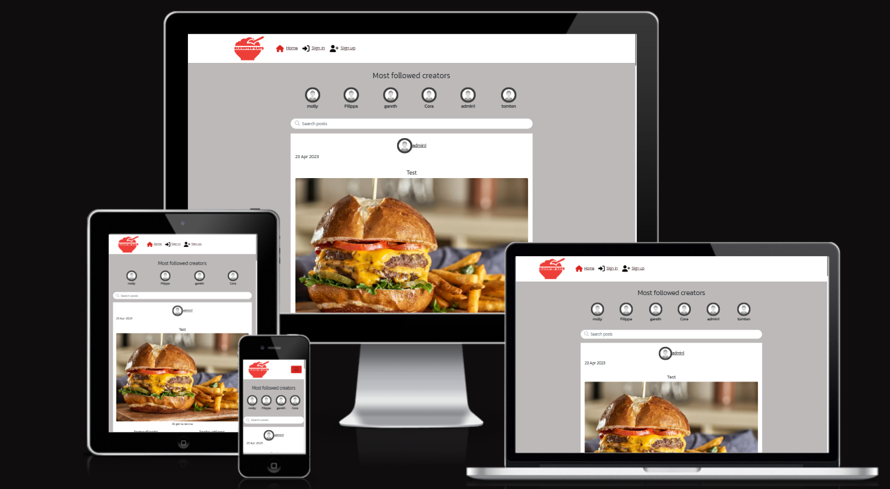

## Site goal

This website is constructed for the foodies out there who love to cook and find new recipes. They are able to post their own construction, get to know each other and find new inspiration. The main goal was to create a space where people can highten their passion for food.

### Agile Planning

This project was developed using agile methods during a 2 week period.

All of the stories created for this project have been placed in a "To do", "In Progress" and "Done" to make it easier for me and to map out where I should start. Most of the stories have criteria assigned to them where you can see what they need to be marked as "Done". This is called a Kanban board and it was created using the github projects and can be located [here](https://github.com/users/MollyAdamsson/projects/7/views/1).

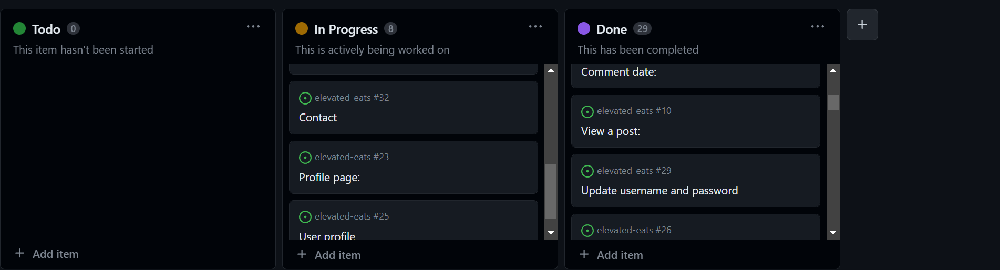

# Epics

### Set up

This epic takes care of the setup of the application and what you need to begin to start coding. 

### Posts/recipes

This epic takes care of the frontend of the website. Here the users interacts with the API when they use they create, read, update and delete their own posts.

### Comments

This epic takes care of the frontend of the website where the users are able to leave comments on posts. Her ethe users interact with the API as well when they add, edit or delete a comment.

### Profiles

This epic takes care of the frontend of the website where the users are able to create a profile of their own. Here the user interacts with the API so that they can manage their profiles.

### Ratings

This epic takes care fo the ratings that can be made on posts/recipes, here the users can rate all recipes except for their own. This is a great interaction feature to understand what people think of your content.

### Reviews 

This epic takes care of the frontend of the website where the users are able to leave reviews on each others posts and review each others profiles. Here the user interact with the API and they can rate/review what and who they want.

# By Epic:

### Set up

* As a user, I would like a favicon on the website so that I can easily know which tab belongs to Elevated Eats

* As a logged out user I can see sign in and sign up options so that I can sign in / sign up

* As a user I can view a navbar from every page so that I can navigate easily between pages

### Posts/recipes

* As a logged in user I can create posts so that I can share my recipes
* As a user I can keep scrolling through the recipes on the website 
* I can search for recipes with keywords, so that I can find the posts/recipes and user profiles I am most interested in.
* As a post/recipe owner I can edit my title and description so that I can make corrections or update my post/recipe after it was created.
* As a logged in user I can view content filtered by users I follow so that I can keep up to date with what they are posting about
* As a logged in user I can view the posts/recipes I liked so that I can find the ones I enjoy the most
* As a user I can view all the most recent posts/recipes, ordered by most recently created first so that I am up to date with the newest content
* As a logged in user I can like a post/recipe so that I can show my support for the posts that interest me
* As a user I can view the details of a single post/recipe so that I can learn more about it

### Comments

* As a logged in user I can add comments to posts/recipes so that I can share my thoughts about the content
* As a user I can see how long ago a comment was made so that I know how old a comment is
* As a user I can read comments on posts/recipes so that I can read what other users think about the posts
* As an owner of a comment I can delete my comment so that I can control removal of my comment from the application
* As an owner of a comment I can edit my comment so that I can fix or update my existing comment

### Profiles

* As a user I can view statistics about a specific user: bio, number of posts/recipes, follows and users followed so that I can learn more about them
* As a user I can view other users profiles so that I can see their posts and learn more about them
* As a logged in user I can edit my profile so that I can change my profile picture and bio
* As a user I can tell if I am logged in or not so that I can log in if I need to
* As a user I can see a list of the most followed profiles so that I can see which profiles are popular
* As a logged in user I can follow and unfollow other users so that I can see and remove posts by specific users in my posts feed
* As a user I can create a new account so that I can access all the features for signed up users

### Ratings

* As a logged in users I can rate other peoples recipes/posts

### Reviews

* As a logged in user I can easily review someone elses profile + see my own reviews

## The structure

### The setup

I added a favicon to the website so that the users easily can navigate between their tabs and keep track of which one belongs to Elevated eats.


I made sure to keep the sign in/sign up and sign out options available at all times to make it simple for the user

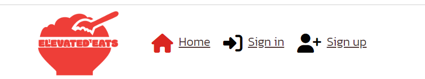
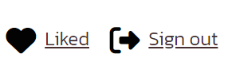

### Navigation


The navigation menu is placed at the top of the site and is fully responsive through any device
The menu collapses into a hamburger icon on smaller devices to make it look more clean

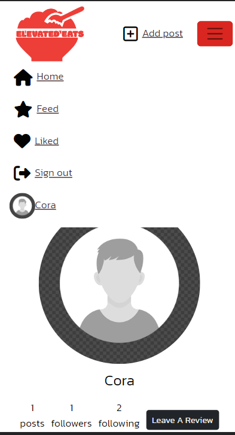

As logged out the user is able to see the isgn in and sign up links
The user can view a fully responsive menu, the items are different depending on wether the user is logged in or not.

When they are logged in they can see:
* Add Post
* Home
* Feed
* Liked
* Sign Out
* Users Icon 

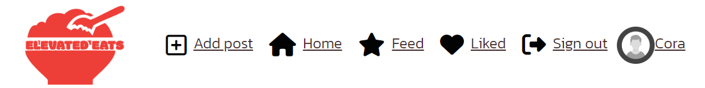

Logged out users can see:

* Home
* Sign In
* Sign Up


### Home

Here I placed all of the posts created on the site.
They are placed in the order of newest to oldest. A user can view this link regardless of having an account or not.

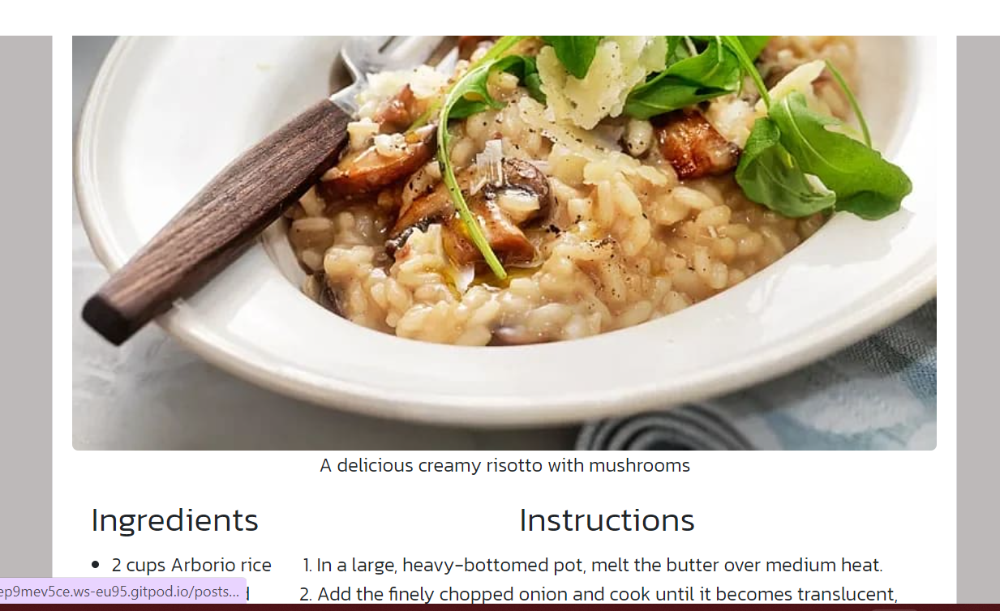

### Posts/recipes

I implemented infinte scrolling to make it easier for the user, when they user have passed ten recipes the scroll bar will jump up and load ten more. 

A post detail page has been added that is visible to all users, this will allow them to see the full post detail and comments. A logged in user have full access to post, comment, like, unlike and ratings.

Only the owner of the recipe are able to edit it. 

The feed link was created to make it easier for the user to only be able to see the posts/recipes created by the ones the user follows. 
 
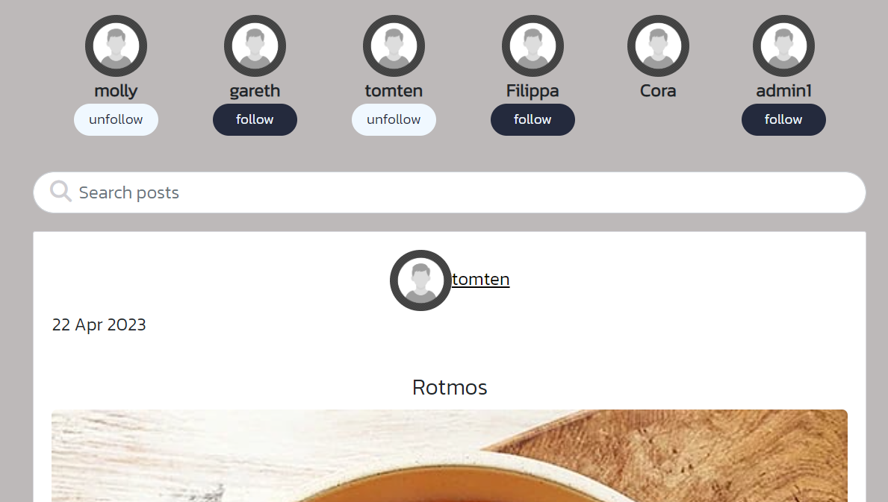

The searchbar was created to offer the oppertunity to search for special ingredients, recipes, followers etc using keywords.


Also, the like button in the navigation menu displays the posts/recipes liked på the user so that they easily can find their favourites. Only logged in users can leave a 'like' on a post/recipe. A like count is available under each post/recipe.


### Comments

When clicking on post details a user can view comments and make comments on their own. Only logged in users are able to comment. A comment count is also available under each post/recipe. The username and the users profilepicture will be shown next to the comment. 

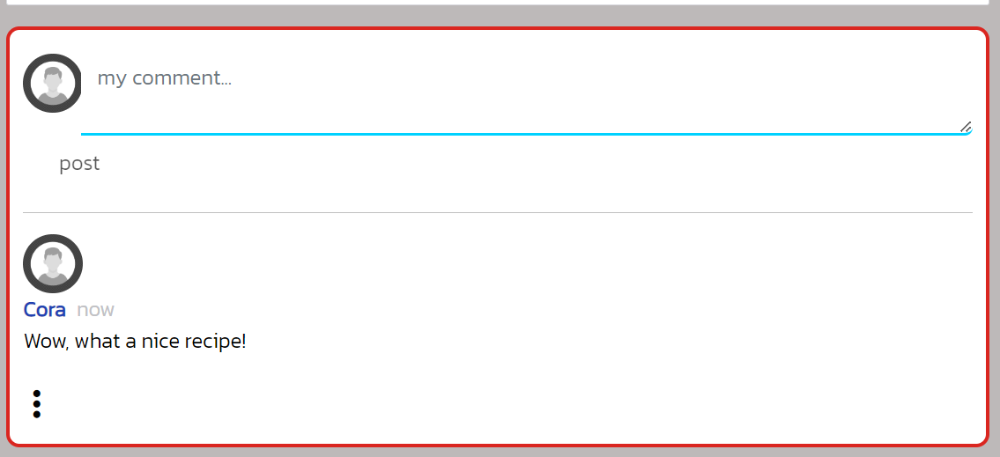

### Profiles

Each user have their own profile page and they are easily viewed if a user click on an Avatar. If the user want to visit their own profile they can click on their own profile via the navigation menu. If they want they can edit their profile, they can choose if they want to change their picture or create a new bio for themselves.

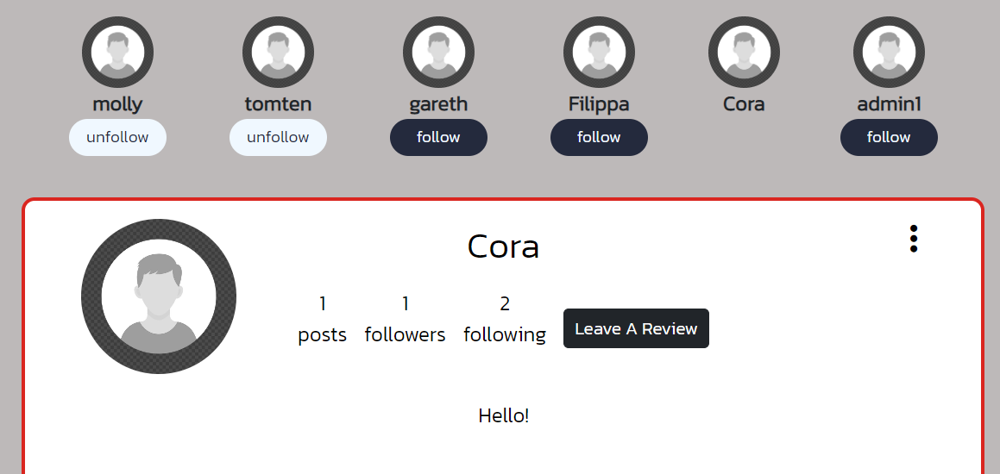

The dropdown menu also offers a chance to change the username and password.

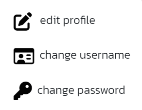

### Reviews

There are review options on every profile.

If a user want to leave review on a profile they are presented with a modal where they can write a comment.

At the end of each profile a user can view the reviews that have been posted by other users. You can leave a review on every profile except your own. The reviews you have left are editable and deletable.


![image]


### Ratings

If users want to they can rate other users recipes. Five stars are presented under each recipe and the users can fill them out. Text will explain the average rating and how many rating counts. A user cant rate their own recipes so the stars wont be visible for them, but they can still view the average rating and the rating count.


# Future Features

In the future I would like to add a form of grocery shopping list. Here the user can like a recipe and then get a full shopping list where they can choose how many people they want to cook for and then get a proper list with the right amount of ingredients.

I would also like to add a contact form where the users can send private messages to each other if they like.

In the future I would also like to add some more styling and finesse to make the site even better looking.

<br>

### The wireframes for the project

<details>

<summary>All Wireframe Images</summary>

## Home Page

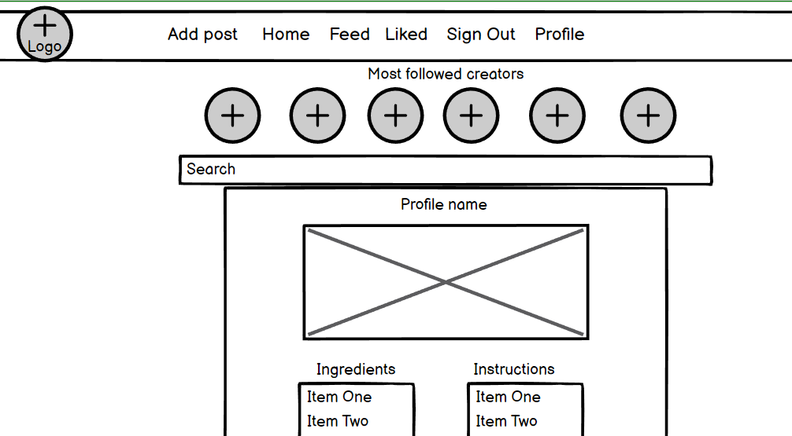

## Feed


## Liked


## Profile Page

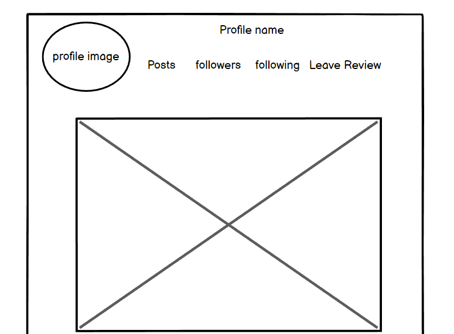

## Create a Post

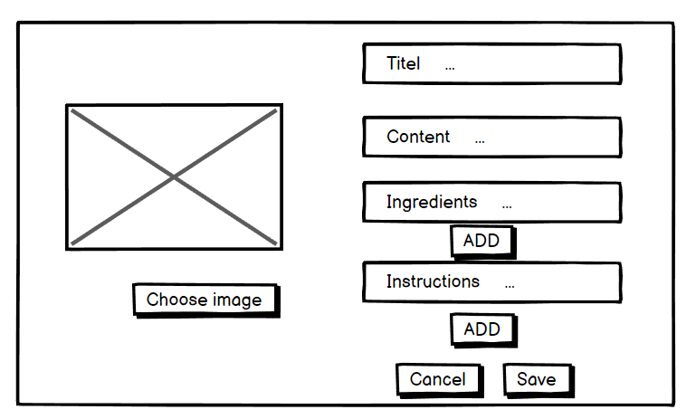

## Sign Up

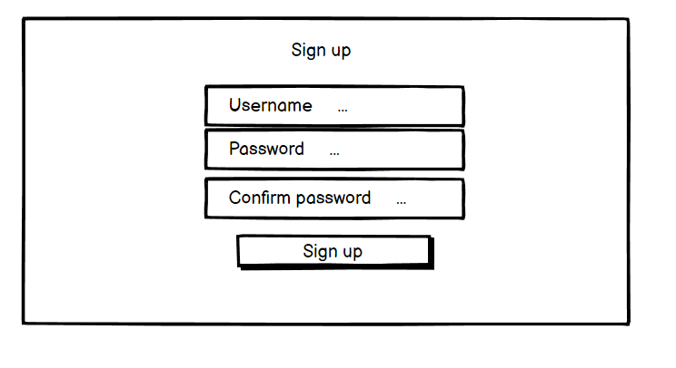

## Sign In


## Reviews

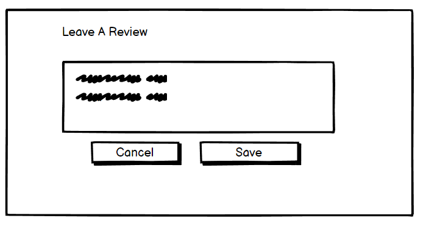

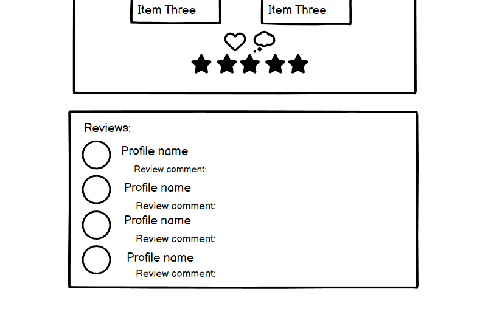

## Ratings

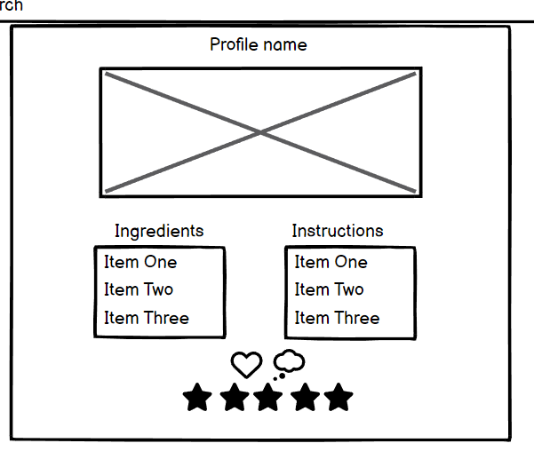

</details>

<br> 

# The Visuals

### The color and design pallete

I chose to keep the site minimalistic and simple, mostly so that all of the focus where on the food.

I chose a white color for the individual components

The icons and borders have a red color.

The main text have a simple black.

And the main background have a greyish tone.

### Typography 

The main font chosen for this project was Kanit.

### Images

The images chosen have been selected from [Pexels](https://www.pexels.com/)

The logo was created by me via a free logo site called [Logo](https://logo.com/)

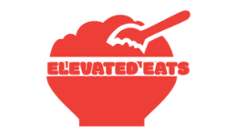

## Technologies 

* [GitHub](https://github.com/) - to host the repositories.
* [Gitpod](https://www.gitpod.io/) - as the IDE for the application.
* [Elephantsql](https://www.elephantsql.com/) - for the postgresql
* [Python](https://docs.python.org/3/contents.html) - Primary language for the backend
* [HTML](https://www.w3schools.com/html/) - Structure/skeleton of the page
* [CSS](https://www.w3schools.com/css/) - extra styling of the webpage
* [Javascript](https://www.w3schools.com/js/) - Primary language for the frontend
* [Stack overflow](https://stackoverflow.com/) - basic explaining 
* [Bootstrap 5](https://www.w3schools.com/bootstrap5/bootstrap_get_started.php) - for design and placement
* [PEP8](http://pep8online.com/) - for testing and validating the code.
* [Google Fonts](https://fonts.google.com/about) - for the font of the text

## Testing

Information about testing can be found [here](https://github.com/MollyAdamsson/elevated-eats/blob/main/TESTING.md)

## Deployment

### [Elephantsql](https://www.elephantsql.com/) 

* Heroku needs sql's to work
* ElephantSQL will manage administrative tasks of PostgreSQL, such as installation, upgrades to latest stable version and backup handling.
* It automates every part of setup and running of PostgreSQL clusters.

1. Log into Heroku 
The first step to creating a free PostgreSQL database is to log in to Heroku. To create a new database on Heroku, an app must first be created within the personal dashboard. 

2. Create a new Heroku app 
Once logged in to Heroku, navigate to the personal app dashboard to create a new Heroku app. Simply click the Create new app button, which should be located on the top-right corner of the dashboard. 

3. Add a PostgreSQL database 
After creating the new app, it's time to attach a PostgreSQL database to it. Simply navigate to the Resources tab located in the header of the app's dashboard. Add the ElephantSql and a free PostgreSQL database has now been successfully created. 

### [Github](https://github.com/) 

* When logging into github, navigate to the settings tab
* Here you can find pages down on the left side
* A new page will load which will present the branch to master or main, and then the save option
* Once the save button has been clicked and the page is reloaded there will be a link to the deployed site.

### [Heroku](https://www.heroku.com/) Deployment:

* Ensure your requirements.txt file has the required dependencies. To do this you can use the following
code in your IDE: pip3 freeze > requirements.txt
* Create or login to you Heroku account
* Navigate to Dashboard
* Click and select "Create app" in the middle of the page
* Enter a unique name for you app
* Select region and the "create app"

### App deployment
* Navgiate to the deploy section
* Scroll down to the "deployment method" and select "Github"
* Authorise the connection
* Also important to make sure you have the right config variables applied, these change the way the app behaves. 
* Go to the settings tab and then click reveal config vars
* Search for the repository name you've chosen
* Make sure you have selected the correct branch (master/main), and select the method you desire.

## Creation

This project was created using Gitpod and then pushed to Github.
To ensure this the user must type:

```git add .``` 

```git commit -m “commit message”```  

```git push``` 

This will make sure all of the files are added, commented on and then pushed to the repository for storage.

## Credits

* I used the Code Institute's videos for 'Moments' (walkthrough project) as guidance whilst setting the base up. 

### Acknowledgements
* This Recipe Blog was created as Portfolio Project 5 for the the Full Stack Software Developer diploma by the [Code Institute](https://codeinstitute.net/). 

* I would like to thank my mentor [Gareth McGirr](https://www.linkedin.com/in/gareth-mcgirr/) for helping me and guiding me through this project, the tutors at code institute for being extremely helpful considering my many questions and to my partner who helped me with mental support.


Molly Adamsson, 2023
