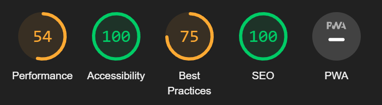
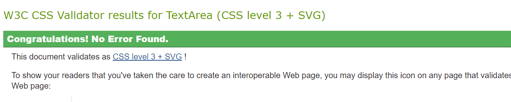

# User story testing

## Posts

* Ensure list page returns all posts = PASS
* Ensure detail page is displayed on clicking post = PASS
* Ensure post can be edited by user who created it = PASS
* Ensure post image field has max value of 5 mb = PASS
* Ensure post can be deleted by user who created it = PASS
* Ensure posts correctly calculates comment count = PASS
* Ensure liked posts displays all liked posts = PASS
* Ensure feed page shows only followed user posts = PASS
* Ensure logged in user can create a post = PASS
* Ensure infinite scroll works as expected = PASS
* Ensure post can be liked/unliked = PASS
* Ensure post can be ratead only by a logged in user = PASS
* Ensure you cant rate your own posts = PASS

## Comments

* Ensure user can create a comment = PASS
* Ensure user can edit a comment = PASS
* Ensure user can delete a comment = PASS
* Ensure date is formatted correctly = PASS
* Ensure all comments can be viewed = PASS

## Profiles

* Ensure user can edit their profile = PASS
* Ensure profile page displays correct content = PASS
* Ensure popular profiles displays = PASS
* Ensure users can follow other users = PASS
* Ensure users can unfollow other users = PASS
* Ensure users can change username = PASS
* Ensure user can change password = PASS
* Ensure all posts by user can be seen on profile = PASS
* Ensure other users can leave a review = PAA
* Ensure all users can leave reviews that has been posted = PASS
* Ensure a user cant leave a review on their own profile = PASS
* Ensure a user can delete/edit their review = PASS

## Auth

* Ensure user can register = PASS 
* Ensure user can log in = PASS
* Ensure signed out users can see correct navigation links = PASS

## Unit Tests 

* Unit tests were created for the navbar module

## Lighthouse testing

Light house testing was performed and found performance to be poor. While this is to be expected with so many images, this could be improved in the future by compressing images before uploading them. Unfortunately, I did not have time to implement this functionality in this iteration.

## Responsiveness

* All pages were tested to ensure responsiveness on screen sizes from 320px and upwards as defined in WCAG 2.1 Reflow criteria for responsive design on Chrome, Edge, Firefox and Explorer

Steps to test:

Open browser and navigate to Elevated Eats
Open the developer tools (right click and inspect)
Set to responsive and decrease width to 320px
Set the zoom to 50%
Click and drag the responsive window to maximum width

* Expected:

Website is responsive on all screen sizes and no images are pixelated or stretched. Nothing is placed horizontally when scroll is present. 

* Actual:

Website behaved as expected.

## Eslint

* Eslint was installed and configured locally. 

## Validators

* All CSS files were individually validated and no errors were found.

## Bugs 

* Recieved some errors with the review data not being rendered properly, adter investigation I found the issue and restored it.

* Some console errors are present due to the authorization calls. These errors were also present in the walkthrough from Code Institute and I did not manage to implement a fix to stop these appearing on time.